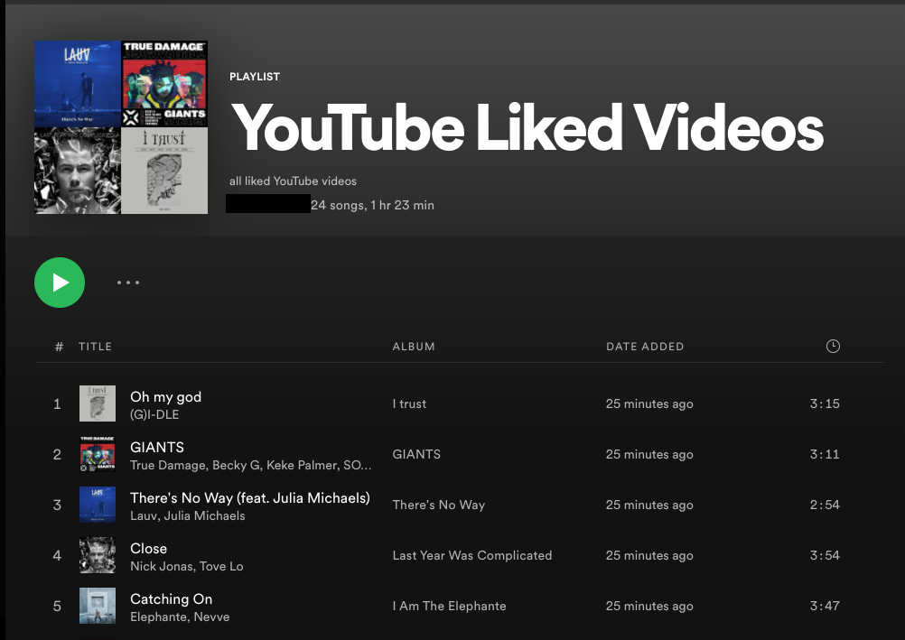

# Automatic Spotify Playlist Generator from Youtube Liked Videos

## Installation Dependencies
Be sure to have the most updated versions of the following Python libraries:  
- google-auth-oauthlib
- google-api-python-client
- requests
To install on Mac Terminal:  

	"python3 -m pip install [package name]"

## Setting Up Credentials
### Spotify Credentials
- Secrets.py must be updated with:
	- your Spotify token with public scope, can be retrieved here: 
		- https://developer.spotify.com/console/post-playlists/
	- your Spotify username

### Google OAuth Client Credentials
	- Setting this part up is a little tricky, but you need to create a project on google console 
	and fill out the client_secret.json with:
		- client_id
		- cilent_secret
	- Both should be retrieved for a NATIVE desktop application 
		- https://support.google.com/cloud/answer/6158849

## Getting a KeyError?
	- Spotify tokens expire hourly, so if you're getting a KeyError, it should go away if you update 
		the token in secrets.py

## Music Video Title Parsing
	Why aren't we using the youtube_dl library?
	- The youtube_dl library is currently unable to retrieve the artist and song.  As an alternative,
	the program parses the title and omits certain words to search for it in Spotify.  
	This occurs in the "clean_title" function (which has much room for improvement). 

	- If the search words are too specific for Spotify, nothing will come up.  The code attempts 
		to combat this by omitting certain phrases typically used in titles of YouTube music videos. 

	- Omitted phrases from the spotify search are as follows:
		- ["official music video", "mv", "m/v", "official video", "music video", "ft", "feat", 
			"official audio", "lyrics", "eng"]
		- nonalphanumeric characters and any non-English characters are omitted from searches as well. 

 